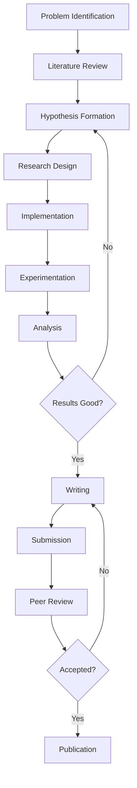

# Chapter 1: Introduction to Research

  <h2 style="margin: 0; color: white;">🎓 Learning Objectives</h2>
  <ul style="margin: 1rem 0 0 0; padding-left: 1.5rem;">
    <li>Understand what research is and why it matters</li>
    <li>Learn the types of research in AI & ML</li>
    <li>Understand the research lifecycle</li>
    <li>Get familiar with research terminology</li>
    <li>Know how to get started with research</li>
  </ul>

## What is Research?

**Research** is a systematic investigation to discover new knowledge, validate existing theories, or solve problems. In AI & ML, research involves:

- **Developing new algorithms** and models
- **Improving existing methods** through novel approaches
- **Applying ML to new domains** and problems
- **Understanding theoretical foundations** of learning
- **Creating tools and frameworks** for the community

!!! note "Research vs. Development"
    - **Research**: Creating new knowledge, exploring unknown territories
    - **Development**: Applying existing knowledge to build products
    - Research is about **discovery**, development is about **implementation**

!!! tip "Why Research Matters"
    Research drives innovation in AI & ML. Every breakthrough (transformers, GANs, reinforcement learning) started as research. Understanding research helps you:
    - Stay at the cutting edge of technology
    - Contribute to the field
    - Build better solutions
    - Pursue advanced degrees or research careers

## Types of Research in AI & ML

### 1. Theoretical Research

Focuses on mathematical foundations, proofs, and theoretical guarantees.

**Examples:**
- Convergence proofs for optimization algorithms
- PAC learning theory
- Information-theoretic bounds
- Complexity analysis

!!! note "Theoretical Research"
    Requires strong mathematical background. Often published in top-tier venues like NeurIPS, ICML, ICLR.

### 2. Empirical Research

Tests hypotheses through experiments and data analysis.

**Examples:**
- Comparing model architectures
- Evaluating on benchmark datasets
- Ablation studies
- Hyperparameter analysis

!!! tip "Empirical Research"
    Most common in ML. Requires good experimental design, statistical analysis, and reproducibility.

### 3. Applied Research

Applies ML to real-world problems in specific domains.

**Examples:**
- Medical diagnosis systems
- Autonomous driving
- Natural language understanding
- Computer vision applications

!!! success "Applied Research"
    Bridges the gap between theory and practice. Often has immediate practical impact.

### 4. Systems Research

Focuses on building efficient systems and infrastructure.

**Examples:**
- Distributed training frameworks
- Model serving systems
- Hardware acceleration
- Optimization libraries

!!! warning "Research Type Selection"
    Choose your research type based on:
    - Your interests and skills
    - Available resources (data, compute)
    - Career goals
    - Advisor's expertise

## Research Lifecycle

### Stage 1: Problem Identification

Identify a research question or problem to solve.

!!! tip "Good Research Questions"
    - **Novel**: Addresses something new or unexplored
    - **Significant**: Has potential impact
    - **Feasible**: Can be answered with available resources
    - **Clear**: Well-defined and specific

### Stage 2: Literature Review

Understand existing work in the area.

!!! note "Literature Review Importance"
    - Avoids reinventing the wheel
    - Identifies gaps in knowledge
    - Provides context for your work
    - Helps position your contribution

### Stage 3: Hypothesis Formation

Formulate testable hypotheses or research questions.

### Stage 4: Research Design

Design experiments to test your hypotheses.

### Stage 5: Implementation

Implement your methods and experiments.

### Stage 6: Experimentation

Run experiments and collect results.

### Stage 7: Analysis

Analyze results and draw conclusions.

### Stage 8: Writing & Publication

Write papers and submit to conferences/journals.

## Research Terminology

### Key Concepts

| Term | Definition |
|------|------------|
| **Hypothesis** | A testable prediction about the relationship between variables |
| **Baseline** | A simple method used for comparison |
| **Ablation Study** | Removing components to understand their contribution |
| **Reproducibility** | Ability to reproduce results with same code/data |
| **Novelty** | The new contribution of your work |
| **State-of-the-Art (SOTA)** | Best performing method on a benchmark |
| **Benchmark** | Standard dataset/task for evaluation |
| **Peer Review** | Evaluation by other researchers |

!!! tip "Understanding Terminology"
    Familiarize yourself with research terminology. It helps you:
    - Read papers more effectively
    - Communicate with researchers
    - Write better papers
    - Understand research discussions

## Getting Started with Research

### Step 1: Build Foundation

!!! success "Foundation Skills"
    1. **Strong ML fundamentals**: Understand core concepts deeply
    2. **Programming skills**: Python, PyTorch/TensorFlow
    3. **Mathematics**: Linear algebra, calculus, probability, statistics
    4. **Reading papers**: Start with 1-2 papers per week
    5. **Reproducing papers**: Implement existing papers

### Step 2: Find Your Interests

!!! tip "Discovering Interests"
    - Read papers in different areas
    - Take courses in various topics
    - Attend seminars and talks
    - Join research groups
    - Work on projects in different domains

### Step 3: Start Small

!!! warning "Don't Overwhelm Yourself"
    - Start with reproducing existing papers
    - Work on small extensions
    - Join existing research projects
    - Don't try to solve major problems immediately

### Step 4: Build Research Skills

!!! note "Essential Skills"
    - **Paper reading**: Learn efficient reading strategies
    - **Literature review**: Systematic search and analysis
    - **Experimental design**: Proper experimental setup
    - **Writing**: Clear technical writing
    - **Presentation**: Communicating research effectively

## Research Resources

???+ "📚 Essential Reading"
    1. [How to Read a Paper](https://web.stanford.edu/class/ee384m/Handouts/HowtoReadPaper.pdf) - S. Keshav
    2. [Research Methodology in Machine Learning](https://www.cs.cmu.edu/~tom/10701_sp11/lectures.shtml) - Tom Mitchell
    3. [Writing a PhD Thesis in ML](https://www.cs.ubc.ca/~murphyk/Thesis/thesis.html) - Kevin Murphy

???+ "🎓 Courses"
    1. [Stanford CS229: Machine Learning](https://www.youtube.com/playlist?list=PLoROMvodv4rMiGQp3W8hdxj9SAMFUClYI)
    2. [MIT 6.034: Artificial Intelligence](https://www.youtube.com/playlist?list=PLUl4u3cNGP63gFHB6xb-kVBiQHYe_4hSi)
    3. [CMU 10-701: Introduction to Machine Learning](https://www.cs.cmu.edu/~epxing/Class/10701/)

???+ "🔬 Research Platforms"
    1. [arXiv](https://arxiv.org/) - Preprint server
    2. [Papers With Code](https://paperswithcode.com/) - Papers with implementations
    3. [Google Scholar](https://scholar.google.com/) - Academic search
    4. [Semantic Scholar](https://www.semanticscholar.org/) - AI-powered research

## Common Research Challenges

!!! warning "Be Prepared"
    - **Time management**: Research takes longer than expected
    - **Uncertainty**: Results may not work as expected
    - **Isolation**: Research can be lonely
    - **Rejection**: Papers get rejected
    - **Imposter syndrome**: Feeling inadequate

!!! tip "Overcoming Challenges"
    - Set realistic timelines
    - Celebrate small wins
    - Join research communities
    - Seek mentorship
    - Remember: everyone faces these challenges

## Next Steps

Now that you understand research fundamentals, proceed to:

- [Chapter 2: How to Read Research Papers](02-reading-papers.md) - Learn efficient paper reading strategies
- [Chapter 3: Finding and Organizing Resources](03-finding-resources.md) - Discover research tools and databases

---

**Key Takeaways:**
- Research is systematic investigation to discover new knowledge
- Types include theoretical, empirical, applied, and systems research
- Research lifecycle: Problem → Literature → Design → Implementation → Analysis → Publication
- Build foundation skills before starting research
- Start small and gradually increase complexity

