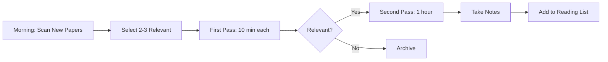

# Chapter 2: How to Read Research Papers

<div style="background: linear-gradient(135deg, #667eea 0%, #764ba2 100%); padding: 2rem; border-radius: 10px; color: white; margin-bottom: 2rem;">
  <h2 style="margin: 0; color: white;">🎓 Learning Objectives</h2>
  <ul style="margin: 1rem 0 0 0; padding-left: 1.5rem;">
    <li>Learn efficient paper reading strategies</li>
    <li>Understand paper structure and sections</li>
    <li>Develop critical reading skills</li>
    <li>Learn to take effective notes</li>
    <li>Master the three-pass reading approach</li>
  </ul>
</div>

## Why Reading Papers is Essential

Reading research papers is a **core skill** for any researcher. It helps you:

- Stay updated with latest developments
- Understand state-of-the-art methods
- Identify research gaps
- Learn from others' approaches
- Build your knowledge base

!!! note "Reading Speed"
    Experienced researchers can read 10-20 papers per week. Beginners should start with 1-2 papers per week and gradually increase.

!!! warning "Common Mistakes"
    - Reading papers linearly from start to finish
    - Trying to understand every detail on first read
    - Not taking notes
    - Reading too many papers without depth

## Paper Structure

Most ML papers follow this structure:

### 1. Abstract
**Purpose**: Summary of the paper (150-250 words)

**Contains**:
- Problem statement
- Proposed method
- Key results
- Main contributions

!!! tip "Abstract First"
    Read the abstract to decide if the paper is relevant. If not, skip it.

### 2. Introduction
**Purpose**: Motivation and context

**Contains**:
- Problem motivation
- Related work overview
- Contributions
- Paper organization

### 3. Related Work
**Purpose**: Contextualize the work

**Contains**:
- Previous approaches
- Comparison with existing methods
- Positioning of the work

### 4. Methodology
**Purpose**: Technical details

**Contains**:
- Proposed method/algorithm
- Mathematical formulations
- Architecture details
- Implementation specifics

!!! note "Most Important Section"
    This is where you'll spend most of your time. Read carefully and take detailed notes.

### 5. Experiments
**Purpose**: Empirical validation

**Contains**:
- Datasets used
- Experimental setup
- Results and comparisons
- Ablation studies

### 6. Results & Discussion
**Purpose**: Analysis and interpretation

**Contains**:
- Detailed results
- Analysis of findings
- Limitations
- Future work

### 7. Conclusion
**Purpose**: Summary and future directions

## Three-Pass Reading Approach

The **three-pass approach** (by S. Keshav) is the most effective way to read papers:

### First Pass: Quick Scan (5-10 minutes)

**Goal**: Determine if the paper is relevant

**Steps**:
1. Read **title, abstract, introduction**
2. Read **section headings** and subheadings
3. Glance at **figures and tables**
4. Read **conclusion**
5. Skim **references** to see if you recognize any

**Questions to Answer**:
- What is the problem?
- What is the proposed solution?
- Is this relevant to my work?
- Should I read more?

!!! tip "First Pass Decision"
    After first pass, decide:
    - **Relevant**: Continue to second pass
    - **Not relevant**: Stop here
    - **Maybe relevant**: Mark for later

### Second Pass: Careful Reading (30-60 minutes)

**Goal**: Understand the main contributions and methodology

**Steps**:
1. Read the **entire paper** carefully
2. **Take notes** on key points
3. Mark **unclear sections** for later
4. Pay attention to **figures and tables**
5. Understand the **experimental setup**

**Focus On**:
- Main idea and contributions
- Methodology overview
- Key results
- Experimental design

!!! note "Don't Get Stuck"
    If you don't understand something, mark it and move on. You can revisit in the third pass.

### Third Pass: Deep Understanding (1-2 hours)

**Goal**: Understand every detail and be able to reproduce

**Steps**:
1. Read **every section** in detail
2. Understand **mathematical derivations**
3. Trace through **algorithms** step by step
4. Understand **experimental details**
5. Critically evaluate the work

**Focus On**:
- Technical details
- Assumptions and limitations
- Potential issues or flaws
- Reproducibility

!!! warning "Third Pass is Selective"
    Only do third pass for papers that are:
    - Highly relevant to your work
    - Papers you need to implement
    - Papers you're reviewing

## Reading Strategies by Purpose

### Reading to Understand a Field

**Goal**: Get overview of a research area

**Strategy**:
1. Start with **survey papers** or **tutorials**
2. Read **recent papers** in the area
3. Follow **citation chains** (backward and forward)
4. Build a **mental map** of the field

!!! tip "Field Overview"
    - Read 10-20 papers in the area
    - Focus on introductions and related work
    - Identify key researchers and groups
    - Note common datasets and benchmarks

### Reading to Implement

**Goal**: Reproduce or implement a method

**Strategy**:
1. Focus on **methodology section**
2. Understand **algorithm details**
3. Note **hyperparameters** and settings
4. Check **supplementary material**
5. Look for **code repositories**

!!! note "Implementation Reading"
    - Read methodology multiple times
    - Draw diagrams to understand flow
    - List all hyperparameters
    - Note any missing details

### Reading to Review

**Goal**: Critically evaluate a paper

**Strategy**:
1. Read **carefully** and **critically**
2. Check **experimental validity**
3. Verify **claims** against results
4. Identify **limitations** and **issues**
5. Assess **novelty** and **significance**

!!! warning "Critical Reading"
    - Question assumptions
    - Check if experiments support claims
    - Look for missing comparisons
    - Verify statistical significance

## Taking Effective Notes

### Note-Taking Template

```markdown
# Paper Title
**Authors**: [Author names]
**Venue**: [Conference/Journal, Year]
**Link**: [URL]

## Summary
[2-3 sentence summary]

## Problem
[What problem does this solve?]

## Method
[Key idea and approach]

## Key Contributions
1. [Contribution 1]
2. [Contribution 2]
3. [Contribution 3]

## Results
[Main experimental results]

## Strengths
- [Strength 1]
- [Strength 2]

## Weaknesses
- [Weakness 1]
- [Weakness 2]

## Questions/Unclear Points
- [Question 1]
- [Question 2]

## Related Papers
- [Paper 1]
- [Paper 2]

## Code/Resources
- [Link to code if available]
```

!!! tip "Note-Taking Tools"
    - **Zotero**: Reference management
    - **Mendeley**: PDF management
    - **Notion/Obsidian**: Note-taking
    - **Paper notebooks**: Traditional approach

### What to Note

**Essential Information**:
- Problem statement
- Proposed solution
- Key contributions
- Main results
- Datasets used
- Limitations

**For Implementation**:
- Algorithm details
- Hyperparameters
- Architecture specifics
- Training details
- Code availability

**For Literature Review**:
- Positioning in the field
- Comparison with other methods
- Citations to follow
- Related work

## Critical Reading Skills

### Questions to Ask

!!! success "Critical Questions"
    1. **What is the problem?** Is it well-defined?
    2. **Is the solution novel?** What's new?
    3. **Are experiments fair?** Proper baselines?
    4. **Do results support claims?** Check figures/tables
    5. **What are limitations?** What doesn't work?
    6. **Is it reproducible?** Enough details?
    7. **What's missing?** What should be included?

### Red Flags

!!! warning "Warning Signs"
    - **No baselines**: Comparing only to weak methods
    - **Small datasets**: Results may not generalize
    - **Missing details**: Can't reproduce
    - **Overstated claims**: Results don't match claims
    - **Poor experimental design**: Unfair comparisons
    - **No code**: Hard to verify

## Reading Workflow

### Daily Reading Routine



!!! tip "Reading Schedule"
    - **Morning**: Scan new papers (arXiv, Twitter)
    - **Afternoon**: Deep reading of selected papers
    - **Evening**: Review notes and organize
    - **Weekly**: Review reading list and plan next week

### Building a Reading List

**Categories**:
- **Must read**: Highly relevant, read soon
- **Should read**: Relevant, read when time
- **Maybe read**: Possibly relevant, review later
- **Read later**: Archive for future reference

!!! note "Reading List Management"
    - Use reference managers (Zotero, Mendeley)
    - Tag papers by topic
    - Keep notes organized
    - Review regularly

## Resources

???+ "📚 Reading Guides"
    1. [How to Read a Paper](https://web.stanford.edu/class/ee384m/Handouts/HowtoReadPaper.pdf) - S. Keshav
    2. [Efficient Reading of Papers in Science and Technology](https://www.cs.ubc.ca/~murphyk/HowToReadPaper.html) - Kevin Murphy
    3. [Reading Research Papers](https://www.cs.columbia.edu/~hgs/etc/writing-style.html) - Columbia Guide

???+ "🛠️ Tools"
    1. [Zotero](https://www.zotero.org/) - Reference management
    2. [Mendeley](https://www.mendeley.com/) - PDF management
    3. [Papers With Code](https://paperswithcode.com/) - Papers with code
    4. [Connected Papers](https://www.connectedpapers.com/) - Paper graphs

???+ "📖 Practice Papers"
    1. Start with **survey papers** in your area
    2. Read **classic papers** (cited frequently)
    3. Follow **recent papers** from top venues
    4. Read **tutorial papers** for new areas

## Next Steps

- [Chapter 3: Finding and Organizing Resources](03-finding-resources.md) - Discover research databases and tools
- [Chapter 4: Research Topics Selection](04-topic-selection.md) - Learn how to pick research topics

---

**Key Takeaways:**
- Use three-pass approach: Quick scan → Careful read → Deep understanding
- Understand paper structure: Abstract → Introduction → Method → Experiments → Results
- Take systematic notes using templates
- Ask critical questions while reading
- Build a reading routine and manage your reading list

