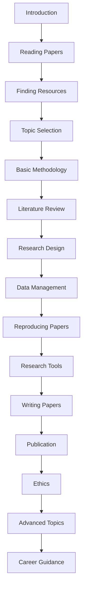

# AI & ML Research Guide - Master's Level

  <h1 style="font-size: 3rem; color: #667eea; margin-bottom: 0.5rem;">🎓 AI & ML Research Guide</h1>
  
Complete Guide from Beginner to Advanced Research

Welcome to the **most comprehensive AI & ML Research Guide** for Master's level students! This guide will take you from understanding research fundamentals to conducting advanced research, publishing papers, and navigating the academic landscape.

!!! success "Complete Research Journey"
    - **Beginner**: Research fundamentals, paper reading, basic methodology
    - **Intermediate**: Research design, literature review, experimental design
    - **Advanced**: Paper writing, publication process, research ethics, career guidance

## 🎯 What You'll Learn

!!! tip "Research Mastery Path"
    - **Fundamentals**: Understanding research, reading papers, finding resources
    - **Methodology**: Research design, experimental setup, data collection
    - **Implementation**: Reproducing papers, coding experiments, using tools
    - **Writing**: Paper structure, LaTeX, figures, citations
    - **Publication**: Conferences, journals, peer review process
    - **Career**: PhD applications, research positions, networking

## 📚 Course Structure

### Part 1: Beginner Level - Research Fundamentals (Chapters 1-5)

!!! tip "Start Here"
    Perfect for beginners! Learn the core concepts of research and how to navigate the academic world.

1. **[Introduction to Research](01-introduction.md)** - What is research? Getting started
2. **[How to Read Research Papers](02-reading-papers.md)** - Paper reading strategies and techniques
3. **[Finding and Organizing Resources](03-finding-resources.md)** - Databases, tools, and organization
4. **[Research Topics Selection](04-topic-selection.md)** - How to pick research topics
5. **[Basic Research Methodology](05-basic-methodology.md)** - Introduction to research methods

### Part 2: Intermediate Level - Research Design (Chapters 6-10)

!!! note "Core Skills"
    Learn to design and conduct your own research projects.

6. **[Literature Review](06-literature-review.md)** - Comprehensive literature analysis
7. **[Research Design & Experimental Setup](07-research-design.md)** - Designing experiments
8. **[Data Collection & Management](08-data-management.md)** - Handling research data
9. **[Reproducing Research Papers](09-reproducing-papers.md)** - Code reproduction and validation
10. **[Research Tools & Platforms](10-research-tools.md)** - Essential tools for research

### Part 3: Advanced Level - Publication & Career (Chapters 11-15)

!!! warning "Advanced Content"
    These chapters require solid understanding of research fundamentals.

11. **[Writing Research Papers](11-writing-papers.md)** - Paper structure, LaTeX, figures
12. **[Publication Process](12-publication-process.md)** - Conferences, journals, peer review
13. **[Research Ethics & Best Practices](13-ethics-practices.md)** - Ethical considerations
14. **[Advanced Research Topics](14-advanced-topics.md)** - Cutting-edge research areas
15. **[Career in Research](15-career-guidance.md)** - PhD, research positions, networking

## 🚀 Quick Start

### Prerequisites

!!! note "What You Need"
    - Basic understanding of machine learning concepts
    - Programming skills (Python recommended)
    - Interest in research and academic work
    - Willingness to read and understand complex papers

### Learning Path

## 💡 Learning Tips

!!! tip "Study Strategy"
    1. **Follow sequentially** - Each chapter builds on previous ones 
    2. **Practice reading papers** - Start with 1-2 papers per week 
    3. **Take notes** - Document what you learn 
    4. **Join communities** - Engage with research communities 
    5. **Build projects** - Apply concepts to real research problems 
    6. **Stay updated** - Follow recent publications and trends 

!!! warning "Common Pitfalls"
    - Don't skip the fundamentals - they're essential
    - Don't try to read too many papers at once
    - Don't ignore research ethics
    - Don't work in isolation - collaborate and discuss

## 🏆 Course Features

!!! success "What Makes This Guide Special"
    - ✅ **15 comprehensive chapters** covering all aspects of research
    - ✅ **Beginner to advanced** progression
    - ✅ **Practical examples** and templates
    - ✅ **Warnings and notes** throughout for better understanding
    - ✅ **Resource collections** with collapsible sections
    - ✅ **Real-world guidance** from experienced researchers
    - ✅ **Career advice** for research positions and PhD

## 📝 Notes & Tips Throughout

Every chapter includes:
- **💡 Tips** - Practical advice and shortcuts
- **📝 Notes** - Important concepts and explanations
- **⚠️ Warnings** - Common pitfalls to avoid
- **✅ Best Practices** - Industry-standard approaches
- **🔬 Research Insights** - Expert perspectives

## 🎯 Learning Objectives

By the end of this guide, you will be able to:

- ✅ Understand research methodology and design
- ✅ Read and critically analyze research papers
- ✅ Select appropriate research topics
- ✅ Conduct comprehensive literature reviews
- ✅ Design and implement experiments
- ✅ Write research papers in LaTeX
- ✅ Navigate the publication process
- ✅ Understand research ethics and best practices
- ✅ Plan your research career path

## 📚 Resource Collections

Each chapter includes extensive resource collections with:
- **Research Papers** - Key papers in the field
- **Books & Textbooks** - Essential reading materials
- **Tools & Platforms** - Research tools and software
- **Courses & Tutorials** - Learning resources
- **Communities** - Research communities and forums

## 🔗 Quick Navigation

### For Beginners
Start from [Chapter 1](01-introduction.md) and progress sequentially. Focus on understanding research fundamentals before moving to advanced topics.

### For Intermediate Learners
Review fundamentals (Chapters 1-5), then focus on research design and implementation (Chapters 6-10).

### For Advanced Users
Jump to specific topics. Use chapters 11-15 for publication and career guidance.

## 🎓 Research Levels

### Beginner Level
- Understanding what research is
- Learning to read papers
- Finding and organizing resources
- Basic research concepts

### Intermediate Level
- Literature review skills
- Research design
- Experimental setup
- Data management

### Advanced Level
- Paper writing and publication
- Research ethics
- Advanced methodologies
- Career planning

## 🤝 Contributing

Found an error or want to improve the guide? Contributions are welcome!

## 📚 Additional Resources

- [Papers With Code](https://paperswithcode.com/) - Papers with implementations
- [arXiv](https://arxiv.org/) - Preprint server
- [Google Scholar](https://scholar.google.com/) - Academic search
- [Connected Papers](https://www.connectedpapers.com/) - Research paper graphs

---

  <h2 style="margin-bottom: 1rem;">Ready to Start Your Research Journey?</h2>
  
Begin with Chapter 1: Introduction to Research

  <a href="01-introduction" style="display: inline-block; padding: 0.75rem 2rem; background: #667eea; color: white; text-decoration: none; border-radius: 5px; font-weight: bold;">Start Chapter 1 →</a>

---

*Last Updated: November 2024*

