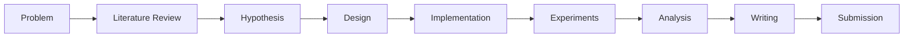

# Quick Reference: AI & ML Research Guide

<div style="text-align: center; margin: 2rem 0;">
  <h1 style="font-size: 2.5rem; color: #667eea; margin-bottom: 0.5rem;">⚡ Quick Reference</h1>
  <p style="font-size: 1.1rem; color: #666;">One-Page Overview of Research Essentials</p>
</div>

!!! tip "Quick Overview"
    This is a condensed reference. See individual chapters for detailed information.

## 📚 Course Structure

### Beginner Level (Chapters 1-5)
1. **Introduction** - What is research?
2. **Reading Papers** - Three-pass approach
3. **Finding Resources** - Databases and tools
4. **Topic Selection** - Choosing research topics
5. **Basic Methodology** - Research fundamentals

### Intermediate Level (Chapters 6-10)
6. **Literature Review** - Comprehensive surveys
7. **Research Design** - Experimental setup
8. **Data Management** - Data handling
9. **Reproducing Papers** - Code reproduction
10. **Research Tools** - Essential tools

### Advanced Level (Chapters 11-15)
11. **Writing Papers** - Paper writing
12. **Publication** - Submission process
13. **Ethics** - Research ethics
14. **Advanced Topics** - Cutting-edge areas
15. **Career** - Research careers

## 🔍 Paper Reading: Three-Pass Approach

### First Pass (5-10 min)
- Read title, abstract, introduction
- Glance at figures and headings
- Read conclusion
- **Goal**: Determine relevance

### Second Pass (30-60 min)
- Read entire paper carefully
- Take notes on key points
- Understand main contributions
- **Goal**: Understand methodology

### Third Pass (1-2 hours)
- Read every detail
- Understand math and algorithms
- Trace through experiments
- **Goal**: Deep understanding

## 📖 Paper Structure

```
Title & Abstract
├── Introduction (motivation, contributions)
├── Related Work (existing methods)
├── Methodology (your approach)
├── Experiments (results, comparisons)
├── Results & Discussion (analysis)
└── Conclusion (summary, future work)
```

## 🎯 Research Process



## 🔬 Experimental Design Checklist

### Before Experiments
- [ ] Research questions defined
- [ ] Datasets selected and split
- [ ] Baselines identified
- [ ] Metrics chosen
- [ ] Hyperparameter space defined

### During Experiments
- [ ] Random seeds set
- [ ] Multiple runs (3-5)
- [ ] Experiment tracking active
- [ ] Results logged

### After Experiments
- [ ] Statistics computed (mean ± std)
- [ ] Ablation studies done
- [ ] Comparisons made
- [ ] Results documented

## 📊 Essential Metrics

| Task Type | Metrics |
|-----------|---------|
| **Classification** | Accuracy, F1, AUC-ROC |
| **Regression** | MSE, MAE, R² |
| **Ranking** | NDCG, MAP, MRR |
| **Generation** | BLEU, ROUGE, FID |

## 🛠️ Essential Tools

### Experiment Tracking
- **Weights & Biases** - Most popular
- **MLflow** - Open source
- **TensorBoard** - Visualization

### Version Control
- **Git + GitHub** - Code versioning
- **DVC** - Data versioning

### Writing
- **LaTeX + Overleaf** - Paper writing
- **Zotero** - Reference management

### Compute
- **Google Colab** - Free GPU
- **Kaggle** - Free compute
- **AWS/GCP** - Cloud compute

## 📝 Paper Writing Tips

### Title
- 10-15 words
- Include key method/contribution
- Searchable keywords

### Abstract (150-250 words)
1. Problem statement
2. Proposed method
3. Key results
4. Impact

### Writing Style
- ✅ Clear and concise
- ✅ Active voice
- ✅ Simple words
- ❌ Verbose
- ❌ Vague
- ❌ Jargon

## 🎓 Top Conferences

### ML Conferences
- **NeurIPS** (Dec) - Neural Information Processing Systems
- **ICML** (Jul) - International Conference on Machine Learning
- **ICLR** (May) - International Conference on Learning Representations
- **AAAI** (Feb) - Association for the Advancement of AI

### CV Conferences
- **CVPR** (Jun) - Computer Vision and Pattern Recognition
- **ICCV** (Oct, biennial) - International Conference on Computer Vision
- **ECCV** (Aug, biennial) - European Conference on Computer Vision

## 🔗 Essential Resources

### Paper Discovery
- **arXiv** - https://arxiv.org/list/cs.LG/recent
- **Papers With Code** - https://paperswithcode.com/
- **Google Scholar** - https://scholar.google.com/
- **Semantic Scholar** - https://www.semanticscholar.org/
- **Connected Papers** - https://www.connectedpapers.com/

### Reference Management
- **Zotero** - https://www.zotero.org/ (Free, recommended)
- **Mendeley** - https://www.mendeley.com/

### Writing Tools
- **Overleaf** - https://www.overleaf.com/ (LaTeX editor)
- **Grammarly** - https://www.grammarly.com/ (Writing assistant)

## ⚠️ Common Mistakes to Avoid

### Experimental
- ❌ Data leakage (preprocessing before split)
- ❌ Tuning on test set
- ❌ Single runs (no statistics)
- ❌ Unfair comparisons
- ❌ Missing ablations

### Writing
- ❌ Poor figures/tables
- ❌ Inadequate citations
- ❌ Missing limitations
- ❌ Unclear contributions
- ❌ Typos and errors

### Research
- ❌ No reproducibility
- ❌ Cherry picking results
- ❌ Ignoring related work
- ❌ Poor organization
- ❌ No documentation

## ✅ Best Practices

### Research
- ✅ Reproducible experiments
- ✅ Multiple runs with statistics
- ✅ Fair comparisons
- ✅ Ablation studies
- ✅ Honest reporting

### Code
- ✅ Version control (Git)
- ✅ Clean, documented code
- ✅ Share code when possible
- ✅ Test thoroughly

### Writing
- ✅ Clear and concise
- ✅ High-quality figures
- ✅ Proper citations
- ✅ Acknowledge limitations
- ✅ Proofread carefully

## 🎯 Research Topic Criteria

Good research topics are:
- **Novel**: Addresses something new
- **Significant**: Has potential impact
- **Feasible**: Can be completed with resources
- **Interesting**: Aligns with your interests
- **Clear**: Well-defined and specific

## 📈 Research Career Paths

### Academic
- PhD Student → Postdoc → Assistant Prof → Associate/Full Prof

### Industry
- Research Scientist → Senior Scientist → Research Director

### Timeline
- PhD: 4-6 years
- Postdoc: 2-4 years
- Tenure: 6-7 years

## 🔑 Key Concepts

| Concept | Definition |
|---------|------------|
| **Baseline** | Simple method for comparison |
| **Ablation** | Remove components to understand contribution |
| **SOTA** | State-of-the-art (best known method) |
| **Reproducibility** | Ability to reproduce results |
| **Novelty** | New contribution of work |

## 💡 Quick Tips

### Reading Papers
- Start with abstract to decide relevance
- Use three-pass approach
- Take systematic notes
- Build reading list

### Experiments
- Split data before preprocessing
- Use validation set for tuning
- Test set only for final evaluation
- Multiple runs with statistics

### Writing
- Follow standard structure
- Write clearly and concisely
- Create high-quality figures
- Cite properly
- Proofread carefully

### Career
- Network actively
- Build portfolio
- Seek mentorship
- Maintain balance

## 🚨 Red Flags in Papers

- No baselines or weak baselines
- Small datasets (may not generalize)
- Missing implementation details
- Overstated claims
- Poor experimental design
- No code available

## 📞 Quick Links

- **Course Overview**: [README](README.md)
- **Chapter 1**: [Introduction](01-introduction.md)
- **Chapter 2**: [Reading Papers](02-reading-papers.md)
- **Chapter 11**: [Writing Papers](11-writing-papers.md)
- **Chapter 12**: [Publication](12-publication-process.md)

---

<div style="text-align: center; margin-top: 2rem; padding: 1.5rem; background: #f5f5f5; border-radius: 8px;">
  <p style="margin: 0; font-size: 1.1rem;">
    <strong>Remember:</strong> Research is a journey. Start with fundamentals, build skills gradually, and stay persistent. Good luck with your research!
  </p>
</div>

---

*Last Updated: November 2024*

