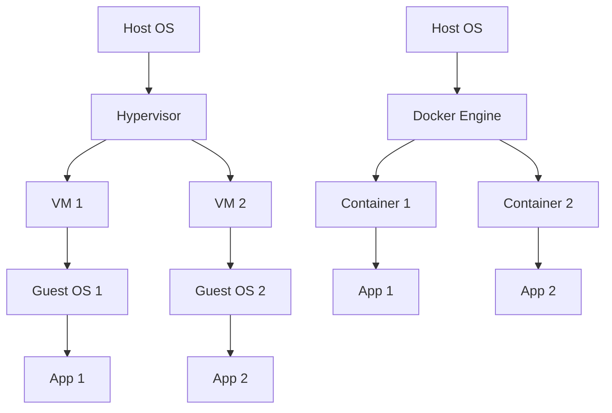

# Introduction to Docker

<div style="background: linear-gradient(135deg, #667eea 0%, #764ba2 100%); padding: 2rem; border-radius: 10px; color: white; margin-bottom: 2rem;">
  <h2 style="margin: 0; color: white;">🐳 Learning Objectives</h2>
  <ul style="margin: 1rem 0 0 0; padding-left: 1.5rem;">
    <li>Understand Docker and containerization concepts</li>
    <li>Install Docker on your system</li>
    <li>Learn Docker architecture and components</li>
    <li>Run your first container</li>
  </ul>
</div>

Welcome to the Docker course! Docker has revolutionized how we develop, ship, and run applications. In this course, you'll learn everything you need to master containerization.

## What is Docker?

Docker is a platform that uses containerization to package applications and their dependencies into lightweight, portable containers. These containers can run consistently across different environments.

!!! note "Why Docker Matters"
    Docker solves the "it works on my machine" problem by packaging applications with all their dependencies. Containers are isolated, portable, and consistent across development, staging, and production environments.

!!! tip "Getting Started"
    If you're new to containers, think of Docker as a lightweight alternative to virtual machines. Containers share the host OS kernel, making them much faster and more efficient than VMs.

## Why Docker?

!!! success "Benefits"
    - **Consistency**: Works the same on your machine, staging, and production
    - **Isolation**: Applications don't interfere with each other
    - **Portability**: Run anywhere Docker is installed
    - **Efficiency**: Lightweight compared to virtual machines
    - **Scalability**: Easy to scale applications horizontally

## Key Concepts

### Containers vs Virtual Machines



### Docker Components

1. **Docker Image**: A read-only template for creating containers
2. **Docker Container**: A running instance of an image
3. **Dockerfile**: A text file with instructions to build an image
4. **Docker Hub**: A registry for Docker images

## Installation

### macOS

**Option 1: Using Homebrew (Recommended)**

Homebrew is a package manager for macOS. If you don't have it, install it first from [brew.sh](https://brew.sh).

```bash
# Using Homebrew
brew install --cask docker
```

**What this does:** This command downloads and installs Docker Desktop for Mac, which includes the Docker engine, CLI, and a GUI application.

**Option 2: Direct Download**

1. Visit [docker.com/products/docker-desktop](https://www.docker.com/products/docker-desktop)
2. Download Docker Desktop for Mac
3. Open the `.dmg` file and drag Docker to Applications
4. Launch Docker from Applications

**After installation:** Docker Desktop will start automatically. You'll see a Docker icon in your menu bar.

### Linux

**For Ubuntu/Debian systems:**

```bash
# Ubuntu/Debian
curl -fsSL https://get.docker.com -o get-docker.sh
sh get-docker.sh
```

**What these commands do:**
- `curl -fsSL https://get.docker.com -o get-docker.sh`: Downloads the official Docker installation script and saves it as `get-docker.sh`
  - `-f`: Fail silently on server errors
  - `-s`: Silent mode (no progress bar)
  - `-S`: Show errors even in silent mode
  - `-L`: Follow redirects
- `sh get-docker.sh`: Executes the installation script, which automatically detects your Linux distribution and installs Docker

**Note:** You may need to run with `sudo` or add your user to the docker group:
```bash
sudo usermod -aG docker $USER
# Log out and log back in for changes to take effect
```

### Verify Installation

After installation, verify Docker is working correctly:

```bash
# Check Docker version
docker --version
```

**Expected output:** `Docker version 24.0.0, build abc123` (version numbers will vary)

```bash
# Run a test container
docker run hello-world
```

**What this does:** This command:
1. Downloads the `hello-world` image from Docker Hub (if not already present)
2. Creates a new container from that image
3. Runs the container, which prints a welcome message
4. The container stops automatically after printing the message

**Expected output:**
```
Hello from Docker!
This message shows that your installation appears to be working correctly.
...
```

## Your First Container

### Running a Simple Container

```bash
# Run a simple container
docker run hello-world
```

**What happens:**
1. Docker checks if the `hello-world` image exists locally
2. If not found, Docker automatically pulls it from Docker Hub
3. Docker creates a new container from the image
4. The container runs, prints a message, and exits

**Understanding the output:** You'll see a message confirming Docker is working. The container runs, completes its task, and stops automatically.

### Running an Interactive Container

```bash
# Run an interactive Ubuntu container
docker run -it ubuntu bash
```

**Breaking down this command:**
- `docker run`: Creates and starts a new container
- `-i`: Interactive mode - keeps STDIN open so you can type commands
- `-t`: Allocates a pseudo-TTY (terminal) - gives you a terminal interface
- `ubuntu`: The base image to use (a minimal Ubuntu Linux system)
- `bash`: The command to run inside the container (starts a bash shell)

**What happens:**
1. Docker downloads the Ubuntu image (first time only, ~70MB)
2. Creates a new container from the image
3. Starts a bash shell inside the container
4. You're now inside the container! You can run Linux commands

**Try these commands inside the container:**
```bash
# Check the OS
cat /etc/os-release

# List files
ls -la

# Check current directory
pwd

# Exit the container
exit
```

!!! tip "Understanding Flags"
    - `-i` (interactive): Allows you to interact with the container's STDIN
    - `-t` (tty): Creates a terminal interface
    - `-it`: Combined, these flags give you an interactive terminal session
    - `-d` (detached): Runs container in background (we'll cover this later)

!!! note "First Time Download"
    The first time you run `docker run ubuntu`, Docker will download the image. This may take a few minutes depending on your internet speed. Subsequent runs will be instant as the image is cached locally.

## What You'll Learn

In this course, we'll cover:

1. **Containers**: Creating and managing containers
2. **Images**: Building custom images
3. **Dockerfiles**: Writing efficient Dockerfiles
4. **Networking**: Connecting containers
5. **Volumes**: Managing persistent data
6. **Docker Compose**: Orchestrating multi-container applications

## Next Steps

Ready to dive in? Let's start by understanding containers in detail.

---

**Next Lesson**: [Working with Containers](02-containers.md)

