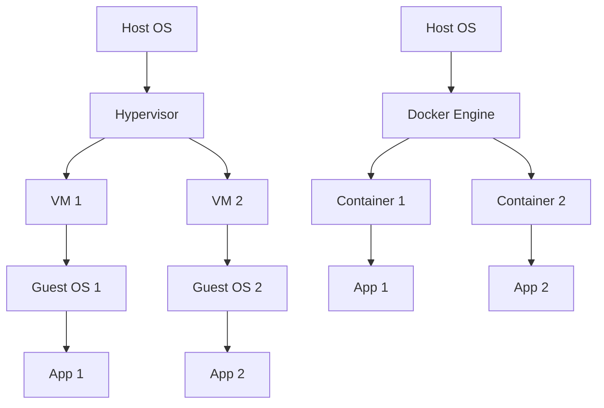

# Introduction to Docker

Welcome to the Docker course! Docker has revolutionized how we develop, ship, and run applications. In this course, you'll learn everything you need to master containerization.

## What is Docker?

Docker is a platform that uses containerization to package applications and their dependencies into lightweight, portable containers. These containers can run consistently across different environments.

## Why Docker?

!!! success "Benefits"
    - **Consistency**: Works the same on your machine, staging, and production
    - **Isolation**: Applications don't interfere with each other
    - **Portability**: Run anywhere Docker is installed
    - **Efficiency**: Lightweight compared to virtual machines
    - **Scalability**: Easy to scale applications horizontally

## Key Concepts

### Containers vs Virtual Machines



### Docker Components

1. **Docker Image**: A read-only template for creating containers
2. **Docker Container**: A running instance of an image
3. **Dockerfile**: A text file with instructions to build an image
4. **Docker Hub**: A registry for Docker images

## Installation

### macOS

```bash
# Using Homebrew
brew install --cask docker

# Or download from docker.com
```

### Linux

```bash
# Ubuntu/Debian
curl -fsSL https://get.docker.com -o get-docker.sh
sh get-docker.sh
```

### Verify Installation

```bash
docker --version
docker run hello-world
```

## Your First Container

```bash
# Run a simple container
docker run hello-world

# Run an interactive Ubuntu container
docker run -it ubuntu bash
```

!!! tip "Tip"
    The `-it` flags run the container in interactive mode with a TTY.

## What You'll Learn

In this course, we'll cover:

1. **Containers**: Creating and managing containers
2. **Images**: Building custom images
3. **Dockerfiles**: Writing efficient Dockerfiles
4. **Networking**: Connecting containers
5. **Volumes**: Managing persistent data
6. **Docker Compose**: Orchestrating multi-container applications

## Next Steps

Ready to dive in? Let's start by understanding containers in detail.

---

**Next Lesson**: [Working with Containers](02-containers.md)

