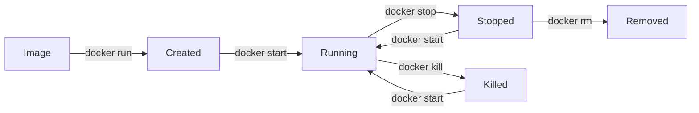

# Working with Containers

<div style="background: linear-gradient(135deg, #f093fb 0%, #f5576c 100%); padding: 2rem; border-radius: 10px; color: white; margin-bottom: 2rem;">
  <h2 style="margin: 0; color: white;">📦 Learning Objectives</h2>
  <ul style="margin: 1rem 0 0 0; padding-left: 1.5rem;">
    <li>Create and run containers</li>
    <li>Manage container lifecycle</li>
    <li>Configure port mapping and environment variables</li>
    <li>Execute commands in running containers</li>
  </ul>
</div>

Containers are the running instances of Docker images. In this lesson, you'll learn how to create, manage, and interact with containers.

!!! tip "Container Lifecycle"
    Containers go through: Created → Running → Stopped → Removed. Use `docker ps -a` to see all containers including stopped ones. Remember to clean up stopped containers with `docker container prune`.

!!! note "Interactive vs Detached Mode"
    Use `-it` flags for interactive containers (like bash sessions). Use `-d` flag to run containers in the background. Interactive mode is great for debugging, detached mode for production services.

## Running Containers

### Basic Run Command

Let's start with the simplest way to run a container:

```bash
# Run a container
docker run nginx
```

**What this does:**
- Downloads the `nginx` image if not present locally
- Creates a new container from the image
- Starts the nginx web server
- **Important:** The container runs in the foreground, blocking your terminal

**Problem:** Your terminal is now blocked. Press `Ctrl+C` to stop the container.

**Solution - Run in Background:**

```bash
# Run in detached mode (background)
docker run -d nginx
```

**What `-d` does:**
- `-d` stands for "detached mode"
- The container runs in the background
- You get your terminal back immediately
- Docker returns the container ID (like `a1b2c3d4e5f6`)

**Example output:** `a1b2c3d4e5f6789012345678901234567890abcdef`

**Naming Your Container:**

```bash
# Run with a custom name
docker run --name my-nginx nginx
```

**Why name containers?**
- Easier to reference: `docker stop my-nginx` instead of `docker stop a1b2c3d4e5f6`
- More readable in `docker ps` output
- Prevents accidental duplicate names (Docker enforces unique names)

**Best Practice:** Always name your containers for easier management:
```bash
docker run -d --name my-nginx nginx
```

### Interactive Containers

Interactive containers let you run commands inside them, like a virtual machine:

```bash
# Run an interactive container
docker run -it ubuntu bash
```

**Step-by-step explanation:**
1. `docker run`: Create and start a container
2. `-i`: Interactive mode - allows input
3. `-t`: Terminal mode - provides a terminal interface
4. `ubuntu`: Use the Ubuntu base image
5. `bash`: Run the bash shell command

**What you'll see:** You'll get a prompt like `root@container-id:/#` - you're now inside the container!

**Running Specific Commands:**

```bash
# Run with a specific command (container exits after command completes)
docker run -it ubuntu ls -la
```

**What happens:**
- Container starts
- Runs `ls -la` (lists files with details)
- Shows the output
- Container stops automatically

**This is useful for:**
- Quick one-off commands
- Testing commands in a clean environment
- Debugging without entering the container

!!! note "Understanding Flags in Detail"
    - `-i` (interactive): Keeps STDIN open even if not attached. Allows you to send input to the container.
    - `-t` (tty): Allocates a pseudo-TTY (terminal). Gives you a proper terminal interface with colors and formatting.
    - `-d` (detached): Runs container in background. Returns control to your terminal immediately.
    - `-it`: Combined, gives you an interactive terminal session (most common for debugging)
    - `-d`: Use for long-running services (web servers, databases, etc.)

## Port Mapping

Containers run in isolation, which means by default, you can't access services running inside them from your host machine. Port mapping solves this by forwarding traffic from your host to the container.

### Basic Port Mapping

```bash
# Map container port to host port
docker run -p 8080:80 nginx
```

**Understanding the syntax:**
- `-p`: Port mapping flag
- `8080:80`: Format is `host_port:container_port`
  - `8080`: Port on your computer (host)
  - `80`: Port inside the container (where nginx listens)

**What this does:**
1. Nginx inside the container listens on port 80 (standard HTTP port)
2. Docker forwards traffic from your computer's port 8080 to the container's port 80
3. You can access nginx at `http://localhost:8080` from your browser

**Why not use port 80 directly?**
- Port 80 might already be in use on your host
- You might want to run multiple web servers
- Ports below 1024 require root privileges on Linux

**Example workflow:**
```bash
# Start nginx with port mapping
docker run -d -p 8080:80 --name my-nginx nginx

# Now open your browser and visit:
# http://localhost:8080
# You should see the nginx welcome page!

# Stop the container when done
docker stop my-nginx
```

### Port Mapping Syntax

```bash
# Basic syntax
-p <host_port>:<container_port>

# Examples:
-p 8080:80        # Map host 8080 to container 80
-p 3000:3000      # Map host 3000 to container 3000 (same port)
-p 127.0.0.1:8080:80  # Bind to specific interface (localhost only)
```

**Detailed explanations:**

**1. Basic mapping:**
```bash
-p 8080:80
```
- Any traffic to `localhost:8080` goes to container port 80
- Accessible from anywhere (if firewall allows)

**2. Binding to localhost only:**
```bash
-p 127.0.0.1:8080:80
```
- Only accessible from your local machine
- More secure - not accessible from network
- Use this for development or local-only services

**3. Multiple port mappings:**
```bash
docker run -p 8080:80 -p 8443:443 nginx
```
- Maps container port 80 to host 8080 (HTTP)
- Maps container port 443 to host 8443 (HTTPS)

!!! tip "Port Mapping Best Practices"
    - Use ports above 1024 to avoid permission issues
    - Document which ports your containers use
    - Check if ports are already in use: `lsof -i :8080` (macOS/Linux) or `netstat -ano | findstr :8080` (Windows)
    - Use specific host IP (127.0.0.1) for security when possible

## Environment Variables

Environment variables are key-value pairs that configure how applications run. Docker allows you to pass environment variables to containers.

### Setting Environment Variables

```bash
# Set a single environment variable
docker run -e MY_VAR=value ubuntu env
```

**What this does:**
- `-e MY_VAR=value`: Sets environment variable `MY_VAR` to `value`
- `env`: Command that prints all environment variables
- You'll see `MY_VAR=value` in the output along with other system variables

**Real-world example - Database connection:**
```bash
# Run a container with database credentials
docker run -e DB_HOST=localhost \
           -e DB_USER=admin \
           -e DB_PASSWORD=secret123 \
           -e DB_NAME=mydb \
           my-app
```

**Multiple variables:**
```bash
# Set multiple environment variables
docker run -e VAR1=value1 -e VAR2=value2 -e VAR3=value3 ubuntu env
```

### Using Environment Files

For many variables, use an environment file:

**Create `.env` file:**
```bash
# .env file content
DB_HOST=localhost
DB_USER=admin
DB_PASSWORD=secret123
DB_NAME=mydb
NODE_ENV=production
API_KEY=abc123xyz
```

**Use the env file:**
```bash
# Use an env file
docker run --env-file .env ubuntu env
```

**What happens:**
- Docker reads all variables from `.env` file
- Sets them as environment variables in the container
- Much cleaner than multiple `-e` flags

**Best practices:**
- Never commit `.env` files with secrets to version control
- Add `.env` to `.gitignore`
- Use `.env.example` as a template (without actual secrets)
- Use Docker secrets or external secret management for production

!!! warning "Security Warning"
    Environment variables are visible in container processes. Don't use them for highly sensitive data. Use Docker secrets or external secret management tools for production.

## Managing Containers

### List Containers

Understanding what containers are running is essential for management:

```bash
# List running containers
docker ps
```

**What you'll see:**
```
CONTAINER ID   IMAGE     COMMAND                  CREATED         STATUS         PORTS                  NAMES
a1b2c3d4e5f6   nginx     "/docker-entrypoint.…"   2 minutes ago   Up 2 minutes   0.0.0.0:8080->80/tcp   my-nginx
```

**Column explanations:**
- **CONTAINER ID**: Unique identifier (first 12 characters shown)
- **IMAGE**: Which image the container is based on
- **COMMAND**: Command running inside the container
- **CREATED**: When the container was created
- **STATUS**: Current state (Up = running, Exited = stopped)
- **PORTS**: Port mappings
- **NAMES**: Container name

**List all containers (including stopped):**
```bash
# List all containers (including stopped)
docker ps -a
```

**Why use `-a`?**
- Shows stopped containers
- Useful for debugging
- See container history
- Check exit codes (why containers stopped)

**List only container IDs:**
```bash
# List only container IDs
docker ps -q
```

**Output:** Just IDs, one per line: `a1b2c3d4e5f6`  
**Use case:** Useful for scripts that need to process multiple containers:
```bash
# Stop all running containers
docker stop $(docker ps -q)
```

### Stop and Start

**Stopping a container:**
```bash
# Stop a running container
docker stop <container_id>
# Or use the name
docker stop my-nginx
```

**What happens:**
- Docker sends SIGTERM signal (graceful shutdown)
- Container has 10 seconds to stop gracefully
- If still running, Docker sends SIGKILL (force kill)
- Container state changes to "Exited"

**Starting a stopped container:**
```bash
# Start a stopped container
docker start <container_id>
# Or use the name
docker start my-nginx
```

**What happens:**
- Container resumes from where it stopped
- Same container ID and name
- All data in volumes is preserved
- Port mappings remain the same

**Restarting a container:**
```bash
# Restart a container (stop then start)
docker restart <container_id>
```

**Use cases:**
- Apply configuration changes
- Recover from errors
- Refresh the container state

### Remove Containers

**Removing stopped containers:**
```bash
# Remove a stopped container
docker rm <container_id>
# Or use the name
docker rm my-nginx
```

**What this does:**
- Permanently deletes the container
- **Warning:** All data in the container (not in volumes) is lost
- Container ID and name become available for reuse

**Removing running containers:**
```bash
# Remove a running container (force)
docker rm -f <container_id>
```

**What `-f` does:**
- `-f` stands for "force"
- Stops the container first, then removes it
- Equivalent to: `docker stop <id>` then `docker rm <id>`

**Clean up all stopped containers:**
```bash
# Remove all stopped containers
docker container prune
```

**What this does:**
- Shows list of stopped containers
- Asks for confirmation (unless `-f` flag used)
- Removes all stopped containers
- Frees up disk space

**Example output:**
```
WARNING! This will remove all stopped containers.
Are you sure you want to continue? [y/N] y
Deleted Containers:
a1b2c3d4e5f6
b2c3d4e5f6a7
Total reclaimed space: 50MB
```

!!! tip "Container Lifecycle Management"
    Regular cleanup prevents disk space issues:
    ```bash
    # Weekly cleanup routine
    docker container prune -f    # Remove stopped containers
    docker image prune -f         # Remove unused images
    docker system prune -f        # Remove all unused resources
    ```

## Container Inspection

```bash
# View container logs
docker logs <container_id>

# Follow logs in real-time
docker logs -f <container_id>

# Inspect container details
docker inspect <container_id>

# View running processes
docker top <container_id>

# View resource usage
docker stats <container_id>
```

## Executing Commands in Running Containers

```bash
# Execute a command in a running container
docker exec <container_id> ls -la

# Open an interactive shell
docker exec -it <container_id> bash
```

!!! warning "Warning"
    Use `docker exec` for running containers. Use `docker run` to create new containers.

## Container Lifecycle



## Practical Example

```bash
# Run a web server
docker run -d \
  --name my-web \
  -p 8080:80 \
  -e ENV=production \
  nginx

# Check if it's running
docker ps

# View logs
docker logs my-web

# Access the web server
curl http://localhost:8080

# Stop and remove
docker stop my-web
docker rm my-web
```

## Exercises

1. Run an nginx container and access it via browser
2. Create a container, stop it, and restart it
3. Run a Python container and execute a Python script
4. Use `docker exec` to modify a file in a running container

---

**Previous**: [Introduction](01-intro.md) | **Next**: [Docker Images](03-images.md)

