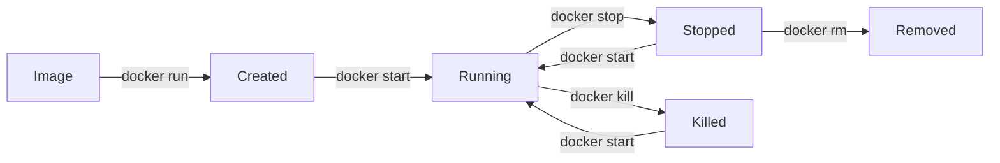

# Working with Containers

Containers are the running instances of Docker images. In this lesson, you'll learn how to create, manage, and interact with containers.

## Running Containers

### Basic Run Command

```bash
# Run a container
docker run nginx

# Run in detached mode (background)
docker run -d nginx

# Run with a custom name
docker run --name my-nginx nginx
```

### Interactive Containers

```bash
# Run an interactive container
docker run -it ubuntu bash

# Run with a specific command
docker run -it ubuntu ls -la
```

!!! note "Note"
    - `-i`: Keep STDIN open (interactive)
    - `-t`: Allocate a pseudo-TTY (terminal)
    - `-d`: Run in detached mode

## Port Mapping

```bash
# Map container port to host port
docker run -p 8080:80 nginx

# Access nginx at http://localhost:8080
```

### Port Mapping Syntax

```bash
-p <host_port>:<container_port>
-p 8080:80        # Map host 8080 to container 80
-p 127.0.0.1:8080:80  # Bind to specific interface
```

## Environment Variables

```bash
# Set environment variables
docker run -e MY_VAR=value ubuntu env

# Use an env file
docker run --env-file .env ubuntu
```

## Managing Containers

### List Containers

```bash
# List running containers
docker ps

# List all containers (including stopped)
docker ps -a

# List only container IDs
docker ps -q
```

### Stop and Start

```bash
# Stop a running container
docker stop <container_id>

# Start a stopped container
docker start <container_id>

# Restart a container
docker restart <container_id>
```

### Remove Containers

```bash
# Remove a stopped container
docker rm <container_id>

# Remove a running container (force)
docker rm -f <container_id>

# Remove all stopped containers
docker container prune
```

## Container Inspection

```bash
# View container logs
docker logs <container_id>

# Follow logs in real-time
docker logs -f <container_id>

# Inspect container details
docker inspect <container_id>

# View running processes
docker top <container_id>

# View resource usage
docker stats <container_id>
```

## Executing Commands in Running Containers

```bash
# Execute a command in a running container
docker exec <container_id> ls -la

# Open an interactive shell
docker exec -it <container_id> bash
```

!!! warning "Warning"
    Use `docker exec` for running containers. Use `docker run` to create new containers.

## Container Lifecycle



## Practical Example

```bash
# Run a web server
docker run -d \
  --name my-web \
  -p 8080:80 \
  -e ENV=production \
  nginx

# Check if it's running
docker ps

# View logs
docker logs my-web

# Access the web server
curl http://localhost:8080

# Stop and remove
docker stop my-web
docker rm my-web
```

## Exercises

1. Run an nginx container and access it via browser
2. Create a container, stop it, and restart it
3. Run a Python container and execute a Python script
4. Use `docker exec` to modify a file in a running container

---

**Previous**: [Introduction](01-intro.md) | **Next**: [Docker Images](03-images.md)

