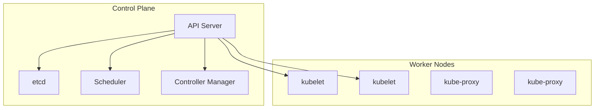

# Introduction to Kubernetes

Welcome to the Kubernetes course! Kubernetes (often abbreviated as K8s) is the industry-standard platform for orchestrating containerized applications at scale.

## What is Kubernetes?

Kubernetes is an open-source container orchestration platform originally developed by Google. It automates the deployment, scaling, and management of containerized applications.

!!! quote "Official Definition"
    Kubernetes is a portable, extensible, open-source platform for managing containerized workloads and services, that facilitates both declarative configuration and automation.

## Why Kubernetes?

### Key Benefits

!!! success "Scalability"
    Automatically scale your applications up or down based on demand.

!!! success "High Availability"
    Self-healing capabilities ensure your applications stay running.

!!! success "Portability"
    Run the same Kubernetes configuration on any cloud or on-premises infrastructure.

!!! success "Resource Management"
    Efficiently utilize compute resources across your cluster.

## Core Concepts

### Cluster Architecture



### Key Components

1. **Pods**: The smallest deployable unit in Kubernetes
2. **Services**: Stable network endpoints for pods
3. **Deployments**: Manage replica sets of pods
4. **Namespaces**: Virtual clusters within a physical cluster

## Kubernetes vs Docker

| Feature | Docker | Kubernetes |
|---------|--------|------------|
| Scope | Single host | Cluster of hosts |
| Orchestration | Docker Compose | Native orchestration |
| Scaling | Manual | Automatic |
| Self-healing | Limited | Built-in |

!!! note "Note"
    Kubernetes works with Docker (and other container runtimes) but provides cluster-level orchestration.

## Installation Options

### Local Development

```bash
# Minikube (local single-node cluster)
minikube start

# Kind (Kubernetes in Docker)
kind create cluster

# Docker Desktop (includes Kubernetes)
# Enable in Docker Desktop settings
```

### Cloud Platforms

- **Google Kubernetes Engine (GKE)**
- **Amazon EKS**
- **Azure AKS**
- **DigitalOcean Kubernetes**

## Your First Kubernetes Command

```bash
# Check cluster status
kubectl cluster-info

# View nodes
kubectl get nodes

# Get cluster version
kubectl version
```

!!! tip "Tip"
    `kubectl` is the command-line tool for interacting with Kubernetes clusters.

## What You'll Learn

In this course, we'll cover:

1. **Pods**: Understanding the basic unit of deployment
2. **Deployments**: Managing application updates and rollouts
3. **Services**: Exposing applications to the network
4. **ConfigMaps and Secrets**: Managing configuration
5. **Scaling and Updates**: Horizontal scaling and rolling updates

## Prerequisites

- Understanding of containers (Docker recommended)
- Basic command-line familiarity
- YAML syntax knowledge (helpful)

## Next Steps

Let's start by understanding Pods, the fundamental building blocks of Kubernetes.

---

**Next Lesson**: [Understanding Pods](02-pods.md)

