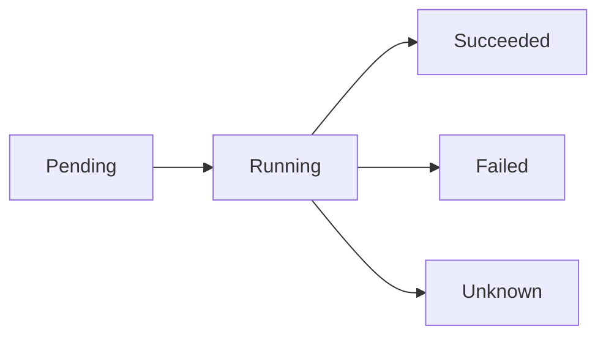

# Understanding Pods

Pods are the smallest and simplest unit in the Kubernetes object model. In this lesson, you'll learn what pods are, how to create them, and how to manage them.

## What is a Pod?

A Pod is a group of one or more containers that share:
- Storage
- Network namespace
- IP address
- Port space

!!! info "Info"
    Most pods contain a single container, but multi-container pods are useful for tightly coupled applications.

## Pod Lifecycle



### Pod Phases

- **Pending**: Pod has been accepted but containers aren't running
- **Running**: Pod is bound to a node and all containers are running
- **Succeeded**: All containers terminated successfully
- **Failed**: At least one container terminated in failure
- **Unknown**: Pod state couldn't be determined

## Creating a Pod

### Using YAML

Create `pod.yaml`:

```yaml
apiVersion: v1
kind: Pod
metadata:
  name: nginx-pod
  labels:
    app: nginx
spec:
  containers:
  - name: nginx
    image: nginx:1.21
    ports:
    - containerPort: 80
```

Apply it:

```bash
kubectl apply -f pod.yaml
```

### Using kubectl

```bash
# Create a pod directly
kubectl run nginx-pod --image=nginx:1.21

# Create with labels
kubectl run nginx-pod --image=nginx:1.21 --labels="app=nginx,env=prod"
```

## Managing Pods

### View Pods

```bash
# List all pods
kubectl get pods

# List pods in a namespace
kubectl get pods -n default

# Get detailed information
kubectl get pods -o wide

# Describe a pod
kubectl describe pod nginx-pod
```

### Pod Logs

```bash
# View logs
kubectl logs nginx-pod

# Follow logs
kubectl logs -f nginx-pod

# Logs from a specific container (multi-container pod)
kubectl logs nginx-pod -c container-name
```

### Executing Commands

```bash
# Execute a command in a pod
kubectl exec nginx-pod -- ls -la

# Open an interactive shell
kubectl exec -it nginx-pod -- bash
```

### Deleting Pods

```bash
# Delete a pod
kubectl delete pod nginx-pod

# Delete using file
kubectl delete -f pod.yaml

# Force delete
kubectl delete pod nginx-pod --force --grace-period=0
```

## Multi-Container Pods

Pods can contain multiple containers that work together:

```yaml
apiVersion: v1
kind: Pod
metadata:
  name: multi-container-pod
spec:
  containers:
  - name: nginx
    image: nginx:1.21
  - name: sidecar
    image: busybox
    command: ['sh', '-c', 'while true; do echo hello; sleep 10; done']
```

!!! tip "Use Case"
    Common patterns: sidecar containers for logging, monitoring, or proxy services.

## Pod Resources

### Resource Requests and Limits

```yaml
apiVersion: v1
kind: Pod
metadata:
  name: resource-pod
spec:
  containers:
  - name: nginx
    image: nginx:1.21
    resources:
      requests:
        memory: "64Mi"
        cpu: "250m"
      limits:
        memory: "128Mi"
        cpu: "500m"
```

!!! warning "Important"
    - **Requests**: Minimum resources guaranteed
    - **Limits**: Maximum resources allowed

## Environment Variables

```yaml
apiVersion: v1
kind: Pod
metadata:
  name: env-pod
spec:
  containers:
  - name: nginx
    image: nginx:1.21
    env:
    - name: ENV_VAR
      value: "production"
    - name: DATABASE_URL
      valueFrom:
        secretKeyRef:
          name: db-secret
          key: url
```

## Health Checks

### Liveness Probe

```yaml
spec:
  containers:
  - name: nginx
    image: nginx:1.21
    livenessProbe:
      httpGet:
        path: /
        port: 80
      initialDelaySeconds: 30
      periodSeconds: 10
```

### Readiness Probe

```yaml
spec:
  containers:
  - name: nginx
    image: nginx:1.21
    readinessProbe:
      httpGet:
        path: /
        port: 80
      initialDelaySeconds: 5
      periodSeconds: 5
```

!!! note "Difference"
    - **Liveness**: Is the container running? (restarts if fails)
    - **Readiness**: Is the container ready to serve traffic? (removes from service if fails)

## Pod Status and Debugging

```bash
# Get pod status
kubectl get pods

# Describe pod (detailed info)
kubectl describe pod nginx-pod

# View events
kubectl get events --sort-by='.lastTimestamp'

# Check pod logs
kubectl logs nginx-pod
```

## Common Issues

### Pod Pending

```bash
# Check why pod is pending
kubectl describe pod <pod-name>

# Common causes:
# - Insufficient resources
# - Node selector mismatch
# - Taints/tolerations
```

### Pod CrashLoopBackOff

```bash
# Check logs
kubectl logs <pod-name>

# Check previous container logs
kubectl logs <pod-name> --previous
```

## Exercises

1. Create a pod running nginx and access it
2. Create a multi-container pod with nginx and a sidecar
3. Add resource limits to a pod
4. Configure liveness and readiness probes
5. Debug a failing pod

---

**Previous**: [Introduction](01-intro.md) | **Next**: [Deployments](03-deployments.md)

