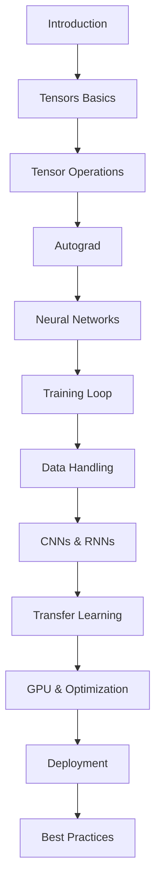

# PyTorch Complete Course

<div style="text-align: center; margin: 2rem 0;">
  <h1 style="font-size: 3rem; color: #ee4c2c; margin-bottom: 0.5rem;">🔥 PyTorch</h1>
  <p style="font-size: 1.2rem; color: #666;">Master Deep Learning with PyTorch</p>
</div>

Welcome to the **most comprehensive PyTorch course** available! This course will take you from absolute beginner to advanced practitioner, covering everything from tensors to production deployment.

## 🎯 What You'll Learn

!!! success "Complete Learning Path"
    - **Fundamentals**: Tensors, operations, and automatic differentiation
    - **Neural Networks**: Building, training, and optimizing models
    - **Data Handling**: Datasets, transforms, and custom data loaders
    - **Advanced Architectures**: CNNs, RNNs, and Transformers
    - **Production**: Deployment, optimization, and best practices

## 📚 Course Structure

### Part 1: Fundamentals (Chapters 1-4)

!!! tip "Start Here"
    Perfect for beginners! Learn the core concepts that form the foundation of PyTorch.

1. **[Introduction & Installation](01-introduction.md)** - Get started with PyTorch
2. **[Tensors Basics](02-tensors-basics.md)** - Understanding the fundamental data structure
3. **[Tensor Operations](03-tensor-operations.md)** - Manipulating and transforming tensors
4. **[Autograd & Gradients](04-autograd.md)** - Automatic differentiation

### Part 2: Neural Networks (Chapters 5-8)

!!! note "Core Concepts"
    Learn to build and train neural networks from scratch.

5. **[Building Neural Networks](05-neural-networks.md)** - Creating models with `nn.Module`
6. **[Loss Functions](06-loss-functions.md)** - Measuring model performance
7. **[Optimizers](07-optimizers.md)** - Training algorithms
8. **[Training Loop](08-training-loop.md)** - Complete training pipeline

### Part 3: Data Handling (Chapters 9-11)

!!! info "Data is Key"
    Master data loading, preprocessing, and augmentation.

9. **[Datasets & DataLoaders](09-datasets-dataloaders.md)** - Efficient data loading
10. **[Data Transformations](10-data-transformations.md)** - Preprocessing and augmentation
11. **[Custom Datasets](11-custom-datasets.md)** - Building your own data loaders

### Part 4: Advanced Architectures (Chapters 12-13)

!!! warning "Advanced Content"
    These chapters require solid understanding of fundamentals.

12. **[Convolutional Neural Networks (CNNs)](12-cnns.md)** - Image processing
13. **[Recurrent Neural Networks (RNNs)](13-rnns.md)** - Sequence modeling

### Part 5: Optimization & Deployment (Chapters 14-17)

!!! success "Production Ready"
    Learn to optimize and deploy models in production.

14. **[Transfer Learning](14-transfer-learning.md)** - Leveraging pre-trained models
15. **[Model Saving & Loading](15-model-saving.md)** - Persistence and checkpointing
16. **[GPU Acceleration](16-gpu-acceleration.md)** - Harnessing GPU power
17. **[Model Deployment](17-deployment.md)** - Deploying to production

### Part 6: Advanced Topics (Chapters 18-20)

!!! tip "Expert Level"
    Advanced techniques for experienced practitioners.

18. **[Debugging & Visualization](18-debugging-visualization.md)** - Tools and techniques
19. **[Advanced Topics](19-advanced-topics.md)** - Cutting-edge techniques
20. **[Best Practices](20-best-practices.md)** - Industry standards

## 🚀 Quick Start

### Installation

```bash
# CPU Only
pip install torch torchvision torchaudio

# With CUDA (GPU)
pip install torch torchvision torchaudio --index-url https://download.pytorch.org/whl/cu118
```

### Your First PyTorch Program

```python
import torch

# Create a tensor
x = torch.tensor([1.0, 2.0, 3.0])
print(f"Tensor: {x}")

# Simple computation
y = x * 2
print(f"Result: {y}")
```

## 💡 Learning Tips

!!! tip "Study Strategy"
    1. **Follow sequentially** - Each chapter builds on previous ones
    2. **Code along** - Type out all examples yourself
    3. **Experiment** - Modify examples and see what happens
    4. **Build projects** - Apply concepts to real problems
    5. **Review regularly** - Revisit earlier chapters

!!! note "Prerequisites"
    - Basic Python knowledge
    - Understanding of NumPy (helpful)
    - Familiarity with machine learning concepts (recommended)
    - No prior deep learning experience required!

## 📖 How to Use This Course

### For Beginners
Start from [Chapter 1](01-introduction.md) and progress sequentially. Don't skip ahead - each concept builds on the previous one.

### For Intermediate Learners
Review fundamentals (Chapters 1-4), then focus on areas you need to strengthen. Use as a reference guide.

### For Advanced Users
Jump to specific topics. Use the [Quick Reference](quick-reference.md) for syntax reminders.

## 🔗 Quick Reference Materials

- **[Quick Reference](quick-reference.md)** - Common operations cheat sheet
- **[Debugging Checklist](debugging-checklist.md)** - Troubleshooting guide
- **[Performance Tips](performance-tips.md)** - Optimization strategies
- **[Complete Guide](GUIDE.md)** - Course summary

## 🎓 Learning Path



## 🏆 Course Features

!!! success "What Makes This Course Special"
    - ✅ **20 comprehensive chapters** covering all aspects
    - ✅ **Practical examples** in every lesson
    - ✅ **Notes and tips** throughout for better understanding
    - ✅ **Real-world applications** and use cases
    - ✅ **Best practices** from industry experts
    - ✅ **Troubleshooting guides** for common issues

## 📝 Notes & Tips Throughout

Every chapter includes:
- **💡 Tips** - Practical advice and shortcuts
- **📝 Notes** - Important concepts and explanations
- **⚠️ Warnings** - Common pitfalls to avoid
- **✅ Best Practices** - Industry-standard approaches

## 🎯 Learning Objectives

By the end of this course, you will be able to:

- ✅ Build neural networks from scratch
- ✅ Train and optimize deep learning models
- ✅ Handle various data types and formats
- ✅ Implement CNNs, RNNs, and advanced architectures
- ✅ Deploy models to production
- ✅ Debug and optimize model performance
- ✅ Apply best practices in real-world projects

## 🤝 Contributing

Found an error or want to improve the course? Contributions are welcome!

## 📚 Additional Resources

- [PyTorch Official Documentation](https://pytorch.org/docs/)
- [PyTorch Tutorials](https://pytorch.org/tutorials/)
- [PyTorch Forums](https://discuss.pytorch.org/)

---

<div style="text-align: center; margin-top: 3rem; padding: 2rem; background: #f5f5f5; border-radius: 8px;">
  <h2 style="margin-bottom: 1rem;">Ready to Start Learning?</h2>
  <p style="font-size: 1.1rem; margin-bottom: 1.5rem;">Begin your PyTorch journey with Chapter 1</p>
  <a href="01-introduction/" style="display: inline-block; padding: 0.75rem 2rem; background: #ee4c2c; color: white; text-decoration: none; border-radius: 5px; font-weight: bold;">Start Chapter 1 →</a>
</div>

---

*Last Updated: November 2024*
